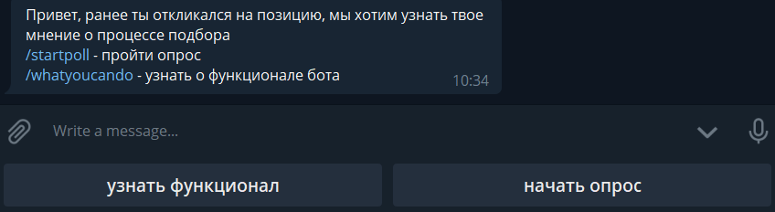

# hr-telegram-poll-bot
бот опроса соискателей о причинах отказа от позиции

стек: Python, Heroku

бот выполняет опрос согласно логике:
* старт + приветствие
* выбор пунктов из меню (узнать функционал, пройти опрос)

* поэтапное прохождение сценария опроса и выбор вариантов вопросов

*  завершение сценария при прощании

* выгрузка пройденных опросов (отправка только админу)
 

полезные команды Heroku:

<xml>

    проверить статус Сервиса
    heroku ps -a hr-telegram-poll-bot

</xml>

<xml>

    информация о Сервисе
    heroku apps:info -a hr-telegram-poll-bot

</xml>

<xml>

    вывести последние логи
    heroku logs -a hr-telegram-poll-bot --tail

</xml>

<xml>

    запуск приложения
    heroku ps:scale worker=1 -a hr-telegram-poll-bot

</xml>

<xml>

    остановка приложения
    heroku ps:scale worker=0 -a hr-telegram-poll-bot

</xml>

@author: vndanilchenko@gmail.com